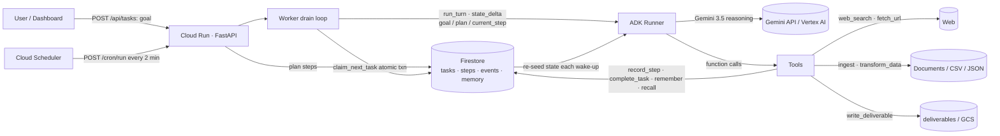

# Agent Atlas — Architecture

## System diagram



`docs/architecture.svg` is a static render of the same diagram for the
submission form.

## Why this shape

**1. State is explicit, durable, and decoupled from chat history.**
The classic stateless agent replays the whole conversation on every call — it
degrades over long, async workflows (context pollution, token cost, hallucinated
"remembered" steps). Atlas instead keeps its position in **Firestore**:
`current_step`, step statuses, and a full event log. Every wake-up, the worker
re-seeds ADK session state via `state_delta` (`{goal, plan, current_step,
task_id}`) and the system instruction renders those variables directly
(`{current_step?}`, `{plan?}`). The model is *grounded in state*, not memory.

**2. Asynchronous by construction.**
- Submission writes a `PENDING` task to Firestore.
- Cloud Scheduler POSTs `/cron/run` on an interval.
- The worker claims `PENDING` tasks in an **atomic Firestore transaction**
  (`PENDING → RUNNING`), runs bounded agent turns, persists every event, and
  re-queues anything unfinished for the next tick.
- Cloud Run scales to zero between ticks — no compute is wasted waiting.

**3. Failure recovery.**
A container can die mid-step: the step was never marked `DONE`, the task stays
unfinished, and the next tick simply picks it up again. Step budget
(`MAX_STEPS_PER_TASK`) fails runaway tasks instead of burning credits forever.

**4. Memory bank.**
`remember` / `recall` write to Firestore scoped per task (`task:{id}`), so a
worker that resumes a task days later recalls prior findings — the "Memory Bank"
pattern from the Fortified Enterprise Fleet track, applied to everyday tasks.

## State machine

```
PENDING → PLANNING → PENDING → RUNNING ⇄ PENDING (re-queue)
                                   │
                                   ├──→ WAITING (human input required)
                                   ├──→ COMPLETED
                                   └──→ FAILED (error / step budget)
```

## Tech choices

| Concern | Choice | Why |
|---|---|---|
| Agent framework | Google ADK (`LlmAgent`, `Runner.run_async`, `ToolContext`) | The brief's framework; built-in session state, callbacks, tool schema from signatures |
| Model | Gemini 3.5 (Gemini API or Vertex AI) | Required; cheap Flash-tier default |
| Async trigger | Cloud Scheduler → HTTP | Scale-to-zero friendly; no always-on poller |
| Compute | Cloud Run | Containerized, autoscaling, zero-cost at rest |
| State | Cloud Firestore | Managed, transactional, no-ops durable store |
| Tools | ADK function tools | Schema auto-generated from typed signatures |
| UI | Vanilla static dashboard served by FastAPI | Zero build step, instant demo |
| Local dev | `STORE_BACKEND=local` JSON files | Runs the whole system with no GCP account |

## Production hardening (documented, not shipped)

- Deliverables to **Cloud Storage** instead of local disk
- Sessions via ADK `DatabaseSessionService` (Cloud SQL) for turn-level durability
- Webhook/pause gates instead of only cron ticks (`WAITING` state already reserved)
- Secret-managed API keys (Secret Manager), OIDC auth on the cron endpoint
- Firestore rules tightened to per-user scopes (see `firestore.rules`)
